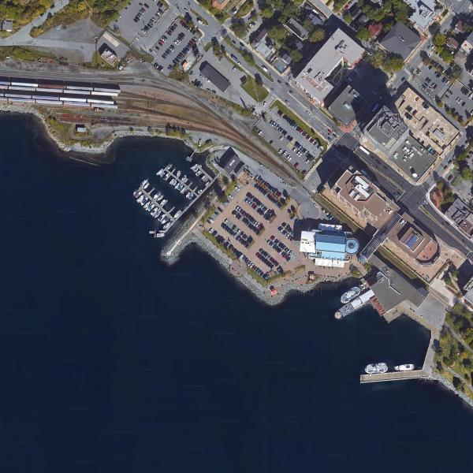
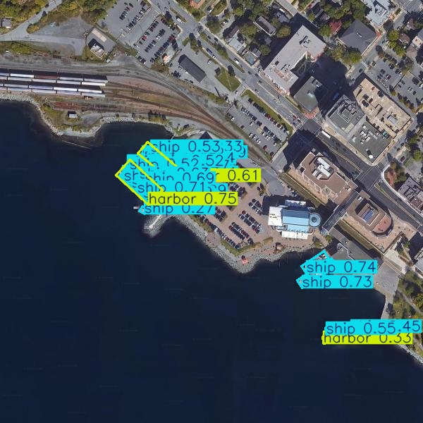

# YOLO-DOTA8

## Requirements

[NVIDIA Container Toolkit](https://docs.nvidia.com/datacenter/cloud-native/container-toolkit/latest/install-guide.html#with-apt-ubuntu-debian)

## Train

`python3 train.py`

## Detect

`python3 detect.py`

### Result

